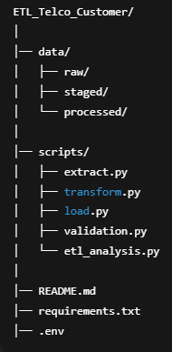

# ETL_Telco_Customer
# 📊 TeleConnect Customer Churn – Full ETL Pipeline  
### Extract → Transform → Load → Validate

This project implements a complete ETL pipeline for **TeleConnect**, a telecom operator facing customer churn.  
The pipeline prepares a high-quality cleaned dataset for analytics and future machine learning models.

---

## 🚀 Project Features

### ✔ Extract (extract.py)
- Creates ETL folder structure:
  - `data/raw`
  - `data/staged`
  - `data/processed`
- Downloads the Telco Customer Churn dataset using **opendatasets**
- Saves raw dataset as:
data/raw/churn_raw.csv

markdown
Copy code

---

### ✔ Transform (transform.py)
Performs **data cleaning + feature engineering**:

#### Cleaning
- Converts `TotalCharges` → numeric (fixes spaces → NaN)
- Fills missing numeric fields with **median**
- `tenure`
- `MonthlyCharges`
- `TotalCharges`
- Fills missing categorical fields with `"Unknown"`

#### Feature Engineering
- `tenure_group` →  
- New  
- Regular  
- Loyal  
- Champion  

- `monthly_charge_segment` →  
- Low (<30)  
- Medium (30–70)  
- High (>70)

- `has_internet_service` →  
- DSL/Fiber optic → 1  
- No → 0

- `is_multi_line_user` →  
- Yes → 1  
- Otherwise → 0

- `contract_type_code` →  
- Month-to-month → 0  
- One year → 1  
- Two year → 2

#### Output:
data/staged/churn_transformed.csv

yaml
Copy code

---

### ✔ Load to Supabase (load.py)
- Creates `churn_customers` table (if not exists)
- Inserts transformed data **in batches of 200**
- Auto-generates UUID for `customerid` if missing
- Handles retry logic + backoff
- Validates schema-column matching before insert

Table schema:

id BIGSERIAL PRIMARY KEY
customerid TEXT
tenure INTEGER
monthlycharges FLOAT
totalcharges FLOAT
churn TEXT
internetservice TEXT
contract TEXT
paymentmethod TEXT
tenure_group TEXT
monthly_charge_segment TEXT
has_internet_service INTEGER
is_multi_line_user INTEGER
contract_type_code INTEGER

yaml
Copy code

---

### ✔ Validate (validate.py)
Runs full data quality checks:

- No missing values in:
  - `tenure`
  - `MonthlyCharges`
  - `TotalCharges`
- Row count matches original dataset (7043)
- Unique row count check
- Supabase row count = staged row count
- All feature segments exist:
  - tenure_group ∈ {New, Regular, Loyal, Champion}
  - monthly_charge_segment ∈ {Low, Medium, High}
- Contract codes ∈ {0,1,2}

Outputs a final validation summary.

---

## 📁 Project Structure

yaml
Copy code

---

## 🔧 Installation

### 1️⃣ Install dependencies
pip install -r requirements.txt

graphql
Copy code

### 2️⃣ Add Supabase credentials to `.env`
SUPABASE_URL=your_supabase_url
SUPABASE_KEY=your_service_role_key

yaml
Copy code

---

## ▶️ How to Run the ETL Pipeline

### Extract
python scripts/extract.py

shell
Copy code

### Transform
python scripts/transform.py

shell
Copy code

### Load into Supabase
python scripts/load.py

shell
Copy code

### Validate
python scripts/validation.py

yaml
Copy code

---

## 🛠 Technologies Used
- Python (Pandas, dotenv)
- Supabase (PostgreSQL)
- opendatasets
- Git + GitHub
- Batch processing & retry logic

---

## 📈 Future Improvements
- Add ML model for churn prediction  
- Add Airflow/Prefect orchestration  
- Build BI dashboards from Supabase  
- Create API endpoints for churn analytics  

---

## 👨‍💻 Author
**Tejaswi Madastu**  
*Data Engineering & Analytics Project – 2025*

---

## ⭐ Support  
If this project helped you, please ⭐ star the repository!