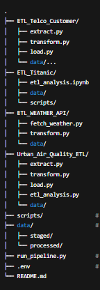

# Extract_Transform_Load_Projects
ETL Projects Collection

A consolidated README for the repository containing multiple ETL projects:
ETL_Telco_Customer — Telco ETL project
ETL_Titanic — Titanic data ETL & analysis (notebook + scripts)
ETL_WEATHER_API — Weather API ETL (raw → transformed)
Urban_Air_Quality_ETL — Urban air-quality ETL + Supabase loader + analysis
scripts/ — shared helper scripts (optional)
data/ — raw, staged, processed data (per-project subfolders)

Prerequisites

Install Python 3.9+ and these common packages (project-specific requirements may vary):

pip install -r requirements.txt
# or install common:
pip install pandas supabase-py python-dotenv matplotlib

On Windows PowerShell, run:

python -m pip install pandas supabase-py python-dotenv matplotlib

Environment variables (.env)

Create a .env file in the repository root (never commit keys). Example values used across projects:

# Supabase (Urban Air Quality loader & analysis)
SUPABASE_URL=https://<PROJECT_REF>.supabase.co
SUPABASE_KEY=<ANON_OR_SERVICE_ROLE_KEY>

# OpenAQ (Air Quality)
OPENAQ_API_BASE=https://api.openaq.org/v2/latest
AQ_CITIES=Delhi,Bengaluru,Hyderabad,Mumbai,Kolkata

# Weather API project (example)
WEATHER_API_KEY=<YOUR_WEATHER_API_KEY>

# General settings
MAX_RETRIES=3
TIMEOUT_SECONDS=10

Important: Do not wrap values in quotes. Example correct line:

SUPABASE_KEY=eyJhbGci...

Quick start — full pipeline

This repo includes run_pipeline.py to run the ETL steps end-to-end for the Urban Air Quality project (edit if you want to run others).

Run in PowerShell from repo root:

python run_pipeline.py

run_pipeline.py will sequentially call:

extract.py

transform.py

load.py (uploads to Supabase)

etl_analysis.py (generate CSV + plots)

You can also run steps individually (see below).

Per-project usage
Urban_Air_Quality_ETL

Transform path: data/staged/air_quality_transformed.csv

Load to Supabase:

python Urban_Air_Quality_ETL/load.py --input "data/staged/air_quality_transformed.csv" --batch 200 --retries 2
# or
python Urban_Air_Quality_ETL/load.py --input "data/staged/air_quality_transformed.csv" --supabase-url "..." --supabase-key "..."

Run analysis (create CSVs + PNGs):

python Urban_Air_Quality_ETL/etl_analysis.py
# or pass credentials via CLI
python Urban_Air_Quality_ETL/etl_analysis.py --supabase-url "..." --supabase-key "..."

ETL_Titanic

Open notebook: ETL_Titanic/etl_analysis.ipynb

Or run any Python scripts in that folder.

ETL_WEATHER_API

Fetch & transform:

python ETL_WEATHER_API/fetch_weather.py
python ETL_WEATHER_API/transform.py

ETL_Telco_Customer

Follow README inside that folder or run the scripts present. If it previously had its own Git repo, we removed the nested .git so it behaves as regular directory.

Data layout & outputs

Standard conventions used across projects:

data/
 ├── raw/            # original or downloaded raw files
 ├── staged/         # transformed CSV(s) ready for loading
 └── processed/      # final outputs, CSVs, and PNGs (analysis results)

Urban Air Quality outputs (examples):

data/staged/air_quality_transformed.csv — staged CSV loaded to DB

data/processed/summary_metrics.csv

data/processed/city_risk_distribution.csv

data/processed/pollution_trends.csv

data/processed/*.png — generated plots

Git & repo notes

If you moved projects into one folder and see warning: adding embedded git repository: ..., remove inner .git:

cd path\to\inner_project
rmdir .git -Recurse -Force
# then from root:
git add .
git commit -m "Add project files"
git branch -M main
git push -u origin main

If git push complains non-fast-forward, prefer to pull & rebase:

git fetch origin
git pull --rebase origin main
# resolve conflicts if any
git push -u origin main

If you intentionally want to overwrite remote, create a backup branch remotely first and then --force push (careful).

Troubleshooting

.env not loaded? Ensure from dotenv import load_dotenv; load_dotenv() is called in scripts that need env variables.

Supabase rejects API key → remove quotes in .env and ensure you pasted the full key.

JSON errors when inserting: ensure NaN are converted to None and datetimes are ISO strings.

Duplicate columns in CSV → rename or dedupe before insert.
If you paste the script error, I’ll diagnose quickly.
Contributing

Add small, focused commits and PRs.

Don’t commit secrets — add .env to .gitignore.

Add project-specific requirements.txt if you add new dependencies.

Add or update README sections per project for specifics.

License

Add your preferred license file (e.g., MIT) to the repo root if you want to open-source. Example LICENSE with MIT text.